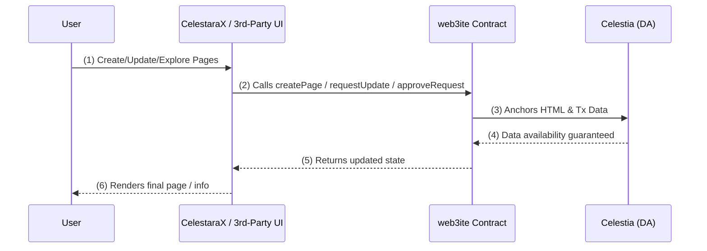
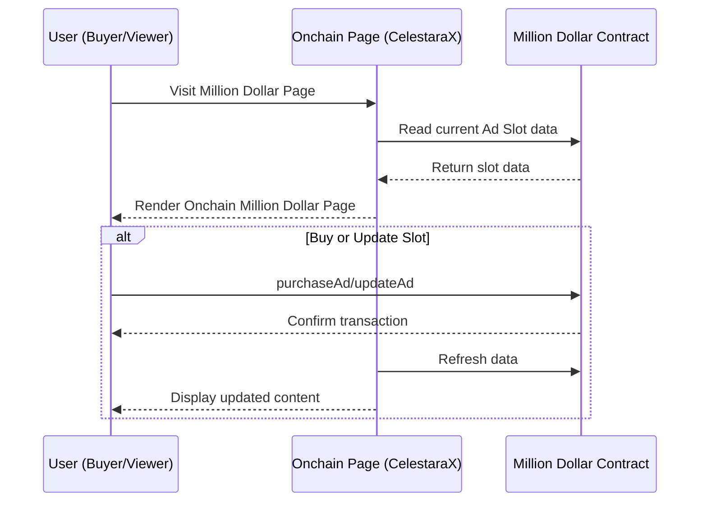

# CelestaraX: The Eternal On-Chain Page Hub

**CelestaraX** is a next-generation platform for **fully on-chain HTML pages**, built on the **Celestia** Data Availability (DA) layer and powered by **Conduit G2**’s massive throughput. Traditionally, hosting web content means trusting centralized servers that can be shut down, censored, or lost over time. In CelestaraX, your pages live **forever** on-chain—publicly verifiable, tamper-proof, and free from single points of failure. By embracing rather than minimizing on-chain data, we enable a new era of **transparent** and **decentralized** publishing.

## Key Features

### `Web3ite` Smart Contract
- Manages all on-chain data: page creation, ownership, update requests, fees, and more
- Supports Single, MultiSig, or Permissionless ownership
- Allows for immutable page flags to lock content forever

### Front-End Flexibility
- CelestaraX hosts an official front-end that communicates with the web3ite contract
- Any third-party can develop their own front-end or dApp leveraging the same smart contract
- **Data is open and universally accessible on-chain**

### Archiving & Updates
- Full HTML stored on a rollup anchored to Celestia
- Ensures censorship resistance and data permanence
- Update proposal system with economic incentives

### Fee Economy
- Update fees accumulate in the contract for each page
- Owners (Single/MultiSig) can withdraw or distribute fees
- Permissionless pages allow random distribution of fees

## High-Level Flow

Below is a **sequence diagram** illustrating how users interact with CelestaraX:

1. **User** accesses a front-end (our official CelestaraX UI or a third-party dApp).
2. The front-end invokes functions on the `web3ite` contract: creating pages, submitting updates, approving changes, withdrawing fees, etc.
3. **Celestia** stores the raw HTML data, ensuring it remains publicly verifiable and censorship-resistant.
4. The front-end displays or updates the on-chain HTML content accordingly.

## Example Use Case: "Onchain Million Dollar Page"

A decentralized advertising platform that demonstrates the power of combining on-chain HTML with smart contract data storage.

### Core Components

#### 1. Million Dollar Contract
- Manages multiple advertising slots with image, link, and expiration data
- Handles slot purchases and ownership transfers
- Functions as an on-chain database for all ad content
- Automated expiration and slot availability management

#### 2. Onchain Frontend (via CelestaraX)
- Complete HTML/CSS/JS interface stored on-chain
- Real-time integration with ad slot contract
- Displays dynamic grid of current advertisements
- No central server dependencies

### Data Flow

### Key Benefits
- **Unstoppable**: No central point of failure for the ad platform
- **Transparent**: All transactions and slot ownership verifiable on-chain
- **Automated**: Smart contract handles payments, durations, and slot management
- **Extensible**: Pattern can be adapted for sponsor walls, NFT displays, or game boards

This example showcases how CelestaraX enables fully decentralized applications by combining on-chain frontend hosting with smart contract data management.

## Why CelestaraX?

1. **Permanent & Unstoppable**
    - Once your page is recorded in Celestia’s DA layer, it remains **verifiable** and **accessible** for as long as the network exists. No central entity can erase or censor it.
2. **Decentralized Proof & Verification**
    - Anyone can independently verify the content on-chain—ensuring authenticity. This fosters a higher level of **trust** than traditional hosting, where data can be changed or removed without notice.
3. **Easy Global Access**
    - Because your content isn’t tied to a single server or URL, it can be retrieved by any node or participant in the network. CelestaraX aims to integrate with domains (like **ENS**) so users can **easily** access your on-chain pages.
4. **Flexible Creation & Governance**
    - Choose from **Single**, **MultiSig**, or **Permissionless** ownership to match your needs—be it personal projects, collaborative groups, or open community hubs.
    - Keep your page fully editable or mark it as **immutable** for a truly *forever* record.
5. **Empowering Creators & Communities**
    - Through **update fees**, CelestaraX introduces new economic models:
        - **Personal Monetization** (Single): Retain full ownership of fees.
        - **Collective Splitting** (MultiSig): Distribute fees evenly among co-owners.
        - **Open Participation** (Permissionless): Reward contributors by randomly redistributing fee proceeds.

## Getting Started

### 1. Deploy / Use `web3ite`
- Interact with the contract via Etherscan or any web3 interface.

### 2. Create Your Page
- Supply your HTML (start with <!DOCTYPE html>), set ownership rules, and optionally make it immutable.

### 3. Explore the Front-End
- Try the official CelestaraX portal to browse, update, or manage fees.

### 4. Build Your Own
- Craft a custom front-end or specialized dApp that calls the same contract, broadening how users can create and experience on-chain pages.

## Join the On-Chain Web

CelestaraX shifts the paradigm from server-based hosting to unbreakable, on-chain data. By focusing on the `web3ite` contract at the core—and enabling countless front-end implementations on top—we invite you to build, collaborate, and innovate in a world where HTML, ownership, and economics converge seamlessly on the blockchain.

Let’s make the web truly decentralized—one page at a time.

## Want to Learn More?
- Website: WIP
- Detailed Docs: [CelestaraX/Contracts](https://github.com/CelestaraX/Contracts)
- X: [@celestarax_](https://x.com/celestarax_)
