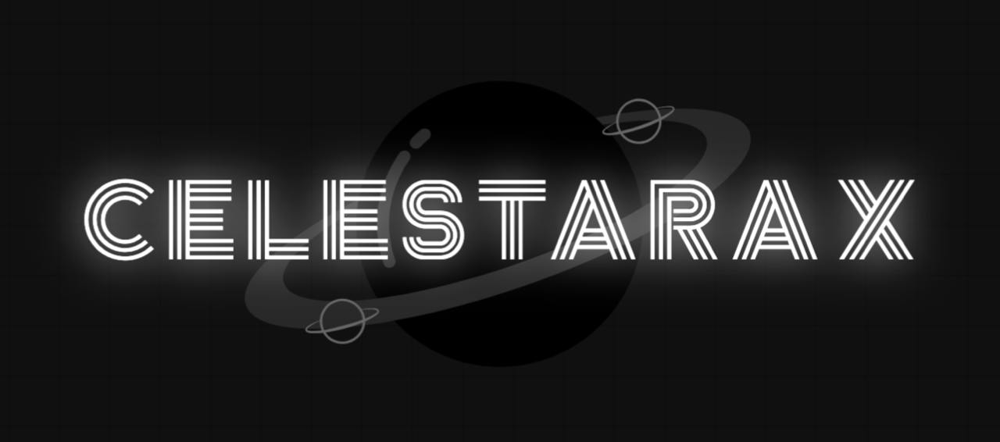
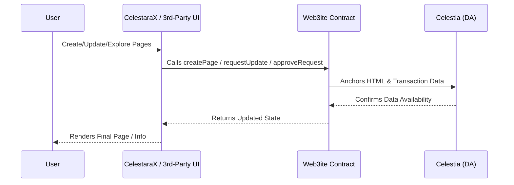
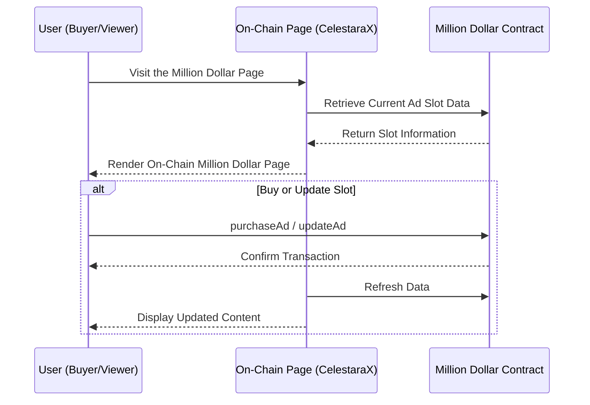

<p align="center">

</p>

# CelestaraX: The Eternal On-Chain Page Hub

**CelestaraX** is a next-generation platform for fully on-chain HTML pages, built on the **Celestia** Data Availability (DA) layer and powered by **Conduit G2**’s massive throughput. Traditional web hosting relies on centralized servers that can be shut down, censored, or lost over time. CelestaraX ensures that your pages live permanently on-chain—publicly verifiable, tamper-proof, and free from single points of failure. By embracing on-chain data rather than minimizing it, we enable a new era of transparent and decentralized publishing.

## Key Features

### `Web3ite` Smart Contract
- Manages all on-chain data, including page creation, ownership, update requests, and fees.
- Supports Single, MultiSig, or Permissionless ownership models.
- Allows for immutable page flags to lock content permanently.

### Front-End Flexibility
- CelestaraX hosts an official front-end that interacts with the Web3ite contract.
- Any third party can develop custom front-ends or dApps leveraging the same contract.
- All data remains open and universally accessible on-chain.

### Archiving & Updates
- Full HTML is stored on a rollup anchored to Celestia, ensuring censorship resistance and data permanence.
- Update proposal system with economic incentives encourages long-term sustainability.

### Fee Economy
- Update fees accumulate in the contract for each page.
- Owners (Single/MultiSig) can withdraw or distribute fees.
- Permissionless pages allow for random redistribution of fees.

## High-Level Flow

The sequence diagram below illustrates how users interact with CelestaraX:



1. Users interact with the official CelestaraX UI or a third-party dApp.
2. The front-end communicates with the Web3ite contract for page creation, updates, fee withdrawals, and approvals.
3. Celestia stores the raw HTML data, ensuring public verification and censorship resistance.
4. The front-end displays or updates the on-chain HTML content.

## Example Use Case: On-Chain Million Dollar Page

A decentralized advertising platform that leverages on-chain HTML and smart contract storage to create a fully transparent and unstoppable ad space.

### Core Components

#### 1. Million Dollar Contract
- Manages multiple advertising slots with images, links, and expiration data.
- Handles slot purchases and ownership transfers.
- Functions as an on-chain database for all ad content.
- Automates expiration and slot availability management.

#### 2. On-Chain Front-End (via CelestaraX)
- Complete HTML/CSS/JS interface stored on-chain.
- Real-time integration with the ad slot contract.
- Displays a dynamic grid of active advertisements.
- No central server dependencies.

### Data Flow



### Key Benefits
- **Unstoppable**: No central point of failure for the ad platform.
- **Transparent**: All transactions and slot ownership details are verifiable on-chain.
- **Automated**: Smart contract handles payments, durations, and slot management.
- **Extensible**: Adaptable for sponsor walls, or NFT displays.

This example showcases how CelestaraX enables fully decentralized applications by combining on-chain frontend hosting with smart contract data management.


## Why CelestaraX?

### 1. Permanent & Unstoppable
Once your page is recorded in Celestia’s DA layer, it remains verifiable and accessible for as long as the network exists. No central entity can erase or censor it.

### 2. Decentralized Proof & Verification
All content is independently verifiable on-chain, ensuring authenticity and trust. Unlike traditional hosting, where data can be modified or removed without notice, CelestaraX guarantees permanence.

### 3. Easy Global Access
Content is not tied to a single server or URL and can be retrieved by any node in the network. CelestaraX aims to integrate with domain systems like **ENS** for seamless access.

### 4. Flexible Creation & Governance
- Choose between **Single**, **MultiSig**, or **Permissionless** ownership for personal page, collaborative groups, or open community hubs.
- Keep your page fully editable or mark it as **immutable** for a permanent record.

### 5. Page Creator & Community Incentive Structure
CelestaraX distributes update fees based on ownership type:
- **Personal Monetization** (Single): Single owners retain full fee ownership.
- **Collective Splitting** (MultiSig): MultiSig owners can distribute fees among co-owners.
- **Open Participation** (Permissionless): Permissionless pages enable contributors to earn fees.

## Getting Started

### 1. Deploy / Use Web3ite
You can either use the existing deployed contract or deploy your own:

#### Option 1: Use Existing Contract
- Contract Address: `0x9E03FDf05833fAd3FF2ABB34F41c52308d65d6Fb`
- View on [Blockscout Explorer](https://explorer-mammothon-g2-testnet-4a2w8v0xqy.t.conduit.xyz/address/0x9E03FDf05833fAd3FF2ABB34F41c52308d65d6Fb)
- Interact with the contract via Blockscout or any web3 interface

#### Option 2: Deploy Your Own Contract
To deploy manually using Foundry:

1. **Install Foundry**:
   ```bash
   curl -L https://foundry.paradigm.xyz | bash
   foundryup
   ```

2. **Clone the repository**:
   ```bash
   git clone https://github.com/CelestaraX/Contracts.git
   cd Contracts
   ```

3. **Install dependencies**:
   ```bash
   forge install
   ```

4. **Build the contracts**:
   ```bash
   forge build
   ```

5. **Deploy the contract using Foundry**:
   ```bash
   forge create src/Web3ite.sol:Web3ite \
       --rpc-url "https://rpc-mammothon-g2-testnet-4a2w8v0xqy.t.conduit.xyz/" \
       --private-key "<your-private-key>" \
       --verify \
       --verifier blockscout \
       --verifier-url "https://explorer-mammothon-g2-testnet-4a2w8v0xqy.t.conduit.xyz/api/" \
       --broadcast
   ```
   Replace `<your-private-key>` with your actual private key. This command deploys **Web3ite** on the **Mammothon G2 Testnet** using Foundry. The contract can be verified via **Blockscout**.

### 2. Create Your Page
- Submit your HTML to the contract (starting with `<!DOCTYPE html>` and ending with `</html>`), define ownership rules, and optionally make it immutable.

### 3. Explore the Front-End
- Use the official CelestaraX portal or any third-party front-end to browse, update, or manage fees.

### 4. Build Your Own
- Develop a custom front-end or dApp that interacts with the Web3ite contract.

## Join the On-Chain Web
CelestaraX transforms web hosting from centralized servers to unbreakable, on-chain data. By placing the Web3ite contract at its core and enabling diverse front-end implementations, we invite developers, creators, and communities to build, collaborate, and innovate in a world where HTML, ownership, and economics converge seamlessly on-chain.

## Learn More
- Contract Details: [CelestaraX/Contracts](https://github.com/CelestaraX/Contracts)
- X: [@celestarax_](https://x.com/celestarax_)

