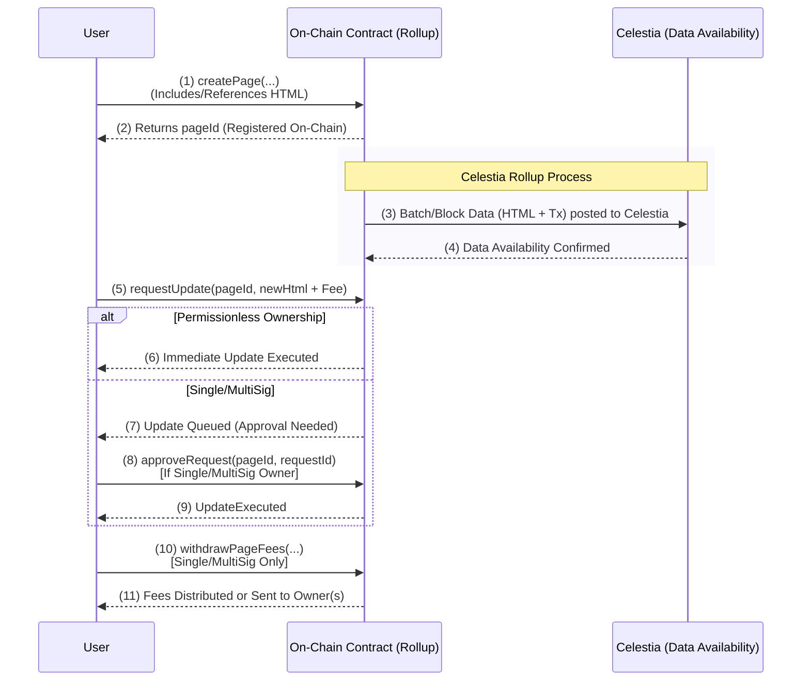

# CelestiVerse: The Eternal On-Chain Page Hub

**CelestiVerse** is a next-generation platform for **fully on-chain HTML pages**, built on the **Celestia** Data Availability (DA) layer and powered by **Conduit G2**’s massive throughput. Traditionally, hosting web content means trusting centralized servers that can be shut down, censored, or lost over time. In CelestiVerse, your pages live **forever** on-chain—publicly verifiable, tamper-proof, and free from single points of failure. By embracing rather than minimizing on-chain data, we enable a new era of **transparent** and **decentralized** publishing.

## Core Idea

- **On-Chain Storage**: Entire HTML pages are stored on a rollup anchored by Celestia’s DA layer, ensuring censorship resistance and perpetual accessibility.
- **Flexible Ownership Models**: Single, MultiSig, or Permissionless—choose the governance style that suits your project or community.
- **Immutable Option**: Mark your page as “immutable” to lock its content forever, guaranteeing a permanent record that can’t be altered.
- **Fee Economy**: Updates require a small fee, fueling a self-sustaining ecosystem. Owners can withdraw these fees (Single/MultiSig) or distribute them randomly (Permissionless).

## High-Level Flow

Below is a **sequence diagram** illustrating how users interact with CelestiVerse:

1. **User** uploads the HTML through the **CelestiVerse Portal**, choosing how the page will be governed (Single, MultiSig, or Permissionless) and whether it’s immutable.
2. The **Portal** uploads the raw data to **Celestia**, guaranteeing **data availability** and permanence.
3. A **createPage** transaction on the **Smart Contract** registers a new `pageId` linked to that Celestia data.
4. **Update requests** require a fee, which the contract collects and then handles according to the page’s ownership model.
5. **Permissionless** pages see updates instantly, while **Single/MultiSig** pages await approval. Fees are eventually **withdrawn** (Single/MultiSig) or **randomly distributed** (Permissionless).

## Why CelestiVerse Matters

1. **Permanent & Unstoppable**
    - Once your page is recorded in Celestia’s DA layer, it remains **verifiable** and **accessible** for as long as the network exists. No central entity can erase or censor it.
2. **Decentralized Proof & Verification**
    - Anyone can independently verify the content on-chain—ensuring authenticity. This fosters a higher level of **trust** than traditional hosting, where data can be changed or removed without notice.
3. **Easy Global Access**
    - Because your content isn’t tied to a single server or URL, it can be retrieved by any node or participant in the network. CelestiVerse aims to integrate with domains (like **ENS**) so users can **easily** access your on-chain pages.
4. **Flexible Creation & Governance**
    - Choose from **Single**, **MultiSig**, or **Permissionless** ownership to match your needs—be it personal projects, collaborative groups, or open community hubs.
    - Keep your page fully editable or mark it as **immutable** for a truly *forever* record.
5. **Empowering Creators & Communities**
    - Through **update fees**, CelestiVerse introduces new economic models:
        - **Personal Monetization** (Single): Retain full ownership of fees.
        - **Collective Splitting** (MultiSig): Distribute fees evenly among co-owners.
        - **Open Participation** (Permissionless): Reward contributors by randomly redistributing fee proceeds.

## Future Directions

- **Element-Level Editing**
    - Break down your page into sections with distinct permission settings, enabling partial immutability and community-driven revisions in different areas.
- **NFT-Backed Sites**
    - Transform page ownership into a tradable NFT, allowing you to transfer or auction entire on-chain websites, along with any embedded fee revenue.
- **Advanced Moderation & Governance**
    - Integrate with **Gnosis Safe** for robust multi-owner management.
    - Incorporate optional AI-based moderation to filter out malicious or unwanted content.
- **Secure Randomness**
    - Adopt **Chainlink VRF** or commit-reveal systems for truly **fair** random distributions in Permissionless mode.
- **Domain Integration**
    - Use **ENS** or DNS solutions to map a friendly domain onto your CelestiVerse page, making the on-chain experience seamless for everyday users.

## Step into the CelestiVerse

CelestiVerse paves the way for a **post-centralized** internet where your site can’t be arbitrarily shut down or modified. With **Celestia**’s scalable DA, **Conduit G2**’s high throughput, and our flexible ownership models, you can:

- **Build** a personal or communal site that **lives on-chain**—accessible and verifiable by anyone.
- **Preserve** critical data or creative works indefinitely, no matter what happens to traditional web hosts.
- **Experiment** with new social, governance, or economic dynamics made possible by open participation and tamper-proof records.

Embrace the **eternal** nature of CelestiVerse and help shape the next evolutionary step in decentralized web publishing. Join us in creating a reality where our **pages and ideas** become **immortal** on the blockchain—**forever**.